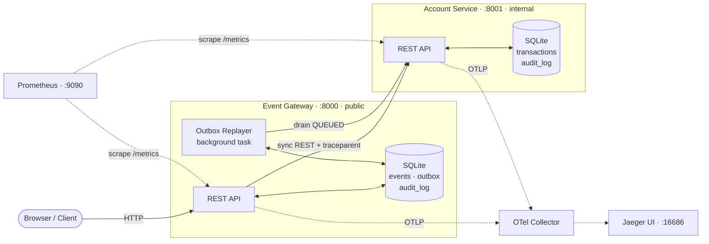

<h1 align="center">📒 Event Ledger</h1>

<p align="center">
  <i>A two-microservice Python implementation of an <b>idempotent, resilient, observable</b> financial event-ingestion system.</i><br/>
  <sub>Schwab take-home · Python 3.11 · FastAPI · OpenTelemetry · Docker Compose</sub>
</p>

<p align="center">
  <a href="https://github.com/neeraj10raja/event-ledger/actions/workflows/ci.yml"></a>
  
  
  
  
  
  
  
</p>

---

## ✨ Highlights

- 🔁 **Idempotent ingestion** — same `eventId` twice never double-applies; duplicates return the original event
- ⏱️ **Out-of-order tolerant** — listings sort by **real UTC chronology**, even when upstream submits the same instant with different timezone offsets
- 🛡️ **Composed resiliency** — `circuit_breaker( retry-with-jitter( timeout( one_http_call ) ) )` on every Gateway→Account call
- 🪂 **Graceful degradation** — when Account is down, `POST /events` returns **503 with a durable QUEUED event**; local reads keep working; an outbox replayer drains automatically on recovery
- 🔍 **End-to-end tracing** — W3C `traceparent` propagated by OpenTelemetry, visualized in Jaeger, stamped on every JSON log line
- 📊 **Production-grade observability** — structured logs, Prometheus `/metrics`, DB-backed audit trail, request-rate limiting
- ✅ **62 tests, 100% passing** — gateway 94% line coverage, account 96%; functional-coverage matrix maps every handout requirement to the specific test that proves it
- 🚀 **One-command demo** — `make up` brings up six containers (services + Jaeger + Prometheus + OTel Collector)

---

## 🧱 Architecture



- The **Gateway** owns the durable event ledger and orchestrates the apply call.
- The **Account Service** owns balances; idempotent at the persistence layer with `ON CONFLICT DO NOTHING` on `event_id`.
- They share **no database**.
- Full design rationale and diagrams live in [`DESIGN.md`](DESIGN.md).

---

## 🚀 Quickstart

```bash
git clone https://github.com/neeraj10raja/event-ledger.git
cd event-ledger
make up        # Build + start gateway, account, Jaeger, Prometheus, OTel collector
make smoke     # Run the end-to-end smoke test
```

Then open:

| Service | URL |
|---|---|
| Gateway OpenAPI | <http://localhost:8000/docs> |
| Account OpenAPI | <http://localhost:8001/docs> |
| 🔍 Jaeger UI | <http://localhost:16686> |
| 📊 Prometheus | <http://localhost:9090> |

Shut down with `make down`. Available Make targets are listed via `make help`.

---

## 🎬 Demo

```bash
# 1. Submit an event
curl -s -X POST http://localhost:8000/events \
  -H 'content-type: application/json' \
  -d '{"eventId":"evt-001","accountId":"acct-123","type":"CREDIT","amount":"150.00",
       "currency":"USD","eventTimestamp":"2026-05-15T14:02:11Z"}' | jq
```

```json
{
  "eventId": "evt-001",
  "accountId": "acct-123",
  "type": "CREDIT",
  "amount": "150.00",
  "currency": "USD",
  "eventTimestamp": "2026-05-15T14:02:11Z",
  "status": "APPLIED",
  "receivedAt": "2026-06-02T22:00:00.123Z",
  "traceId": "4b7e3f8c9a2d1e0f5c8b6a4d2e1f3a5c"
}
```

```bash
# 2. Submit it again — idempotent (returns 200, no duplicate)
curl -s -X POST http://localhost:8000/events ... | jq '.status'  # "APPLIED" — balance unchanged

# 3. Submit a DEBIT with an *earlier* timestamp (out of order)
# Listing is still chronological:
curl -s 'http://localhost:8000/events?account=acct-123' \
  | jq '.items | map({eventId, eventTimestamp})'

# 4. Take Account down — POST /events returns 503 with status:"QUEUED"
docker compose stop account
curl -s -X POST http://localhost:8000/events ...     # 503, event durably queued
curl -s http://localhost:8000/events/evt-001 | jq    # 200 — local read works

# 5. Bring Account back. Within 5 seconds the outbox drains and the event flips to APPLIED.
docker compose start account
```

Trace the request end-to-end in Jaeger at <http://localhost:16686> — same trace ID across both services.

---

## 💪 Resiliency: Composed Patterns

> The Gateway → Account call is wrapped in three layered patterns. Composition order matters — each handles a different failure mode.

| Layer | Tool / Code | Defaults | Failure mode addressed |
|---|---|---|---|
| **Timeout** | `httpx.Timeout(2.0, connect=0.5)` | hard ceiling per attempt | hung / slow downstream |
| **Retry w/ exp. backoff + jitter** | [`tenacity`](https://github.com/jd/tenacity) | 3 attempts, 0.1 → 1.5 s | transient network blips, 5xx |
| **Circuit breaker** | [`app/resilience/circuit_breaker.py`](services/gateway/app/resilience/circuit_breaker.py) (in-house async) | `fail_max=5`, `reset_timeout=30s` | sustained downstream failure |

**Composition (outer → inner):** `circuit_breaker( retry( one_http_call ) )` — each Gateway request consumes exactly **one** breaker attempt; inner retries don't inflate the failure counter, so brief blips don't trip the breaker, but sustained outages will.

> **Why an in-house breaker?** `pybreaker.call_async` is implemented via Tornado's `@gen.coroutine` and silently miscounts failures of `await`ed asyncio calls — the breaker would never open. The in-house implementation is ~100 lines and fully unit-tested (state transitions, half-open probe, recovery).

**Async fallback queue (outbox)** — events that hit the breaker or exhaust retries land in the `outbox` table with status `QUEUED`. A background asyncio task polls every 5 seconds, replays them via the same resilient client, and transitions them to `APPLIED` on success. Idempotency at both layers makes replay safe.

---

## 🪂 Graceful Degradation

| Endpoint | Account up | Account **down** |
|---|---|---|
| `POST /events` | `201` APPLIED | `503` **QUEUED** — durable, replayed later |
| `GET /events/{id}` | `200` | `200` ✅ local read |
| `GET /events?account=…` | `200` | `200` ✅ local read |
| `GET /accounts/{id}/balance` | `200` | `503` (Account is source of truth) |
| `GET /health` | `status: ok` | `status: degraded` |

---

## 🔭 Observability

<table>
<tr><th>Pillar</th><th>Implementation</th></tr>
<tr><td><b>Tracing</b></td><td>
OpenTelemetry SDK → OTel Collector → Jaeger. <code>HTTPXClientInstrumentor</code> auto-injects W3C <code>traceparent</code> on every outbound request — proven by a respx-based test that asserts the header matches the active span's trace id.
</td></tr>
<tr><td><b>Logging</b></td><td>
<code>structlog</code> emitting JSON. Every line stamped with <code>timestamp</code>, <code>level</code>, <code>service</code>, <code>trace_id</code>, <code>span_id</code>, and request-specific fields. HTTP access middleware logs <code>method/path/status/duration_ms</code>.
</td></tr>
<tr><td><b>Metrics</b></td><td>
Prometheus <code>/metrics</code> on both services. Series include <code>events_received_total{type,result}</code>, <code>account_client_duration_seconds{outcome}</code>, <code>circuit_breaker_state</code> (0=closed, 1=half-open, 2=open), <code>outbox_depth</code>.
</td></tr>
<tr><td><b>Audit</b></td><td>
First-class <code>audit_log</code> table on both services capturing every state transition (<code>RECEIVED</code> · <code>DEDUPED</code> · <code>APPLIED</code> · <code>FAILED</code> · <code>QUEUED</code> · <code>REPLAYED</code>) with <code>actor</code>, <code>trace_id</code>, and structured <code>details</code>. Same record mirrored as an <code>audit=true</code> log line.
</td></tr>
</table>

---

## 🧪 Tests

```bash
make install-dev   # install runtime + test deps
make coverage      # run both suites, generate HTML under docs/coverage/
```

| Service | Tests | Line Coverage |
|---|---|---|
| Gateway | 45 | **94 %** |
| Account | 17 | **96 %** |

Every requirement in the handout maps to a specific test in [`docs/functional-coverage.md`](docs/functional-coverage.md). HTML reports browsable under [`docs/coverage/`](docs/coverage/).

What's covered, at a glance:

- ✅ **Idempotency** (gateway + account, both layers)
- ✅ **Out-of-order tolerance**, including the **mixed-timezone-offset** edge case
- ✅ **Validation** — negative/zero amounts, unknown types, missing & extra fields
- ✅ **Resiliency** — circuit-breaker state machine (closed → open → half-open → closed), retry-on-5xx-but-not-4xx, breaker trips after sustained failure
- ✅ **Graceful degradation** — 503 + QUEUED, local reads work, health reports degraded
- ✅ **Trace propagation** — W3C `traceparent` actually appears in the outbound HTTP request
- ✅ **Outbox replay** — drains after recovery, marks FAILED on permanent 4xx

---

## 📚 Documentation

| Doc | What's inside |
|---|---|
| [`DESIGN.md`](DESIGN.md) | Full design document — architecture, sequence flow, event state machine, resiliency choice rationale, trade-offs |
| [`docs/api-contracts.md`](docs/api-contracts.md) | Authoritative request/response shapes for every endpoint |
| [`docs/functional-coverage.md`](docs/functional-coverage.md) | Requirement → test mapping |
| [`docs/ai-workflow.md`](docs/ai-workflow.md) | How AI tools were used across Design / Development / QA phases |
| [`docs/diagrams/`](docs/diagrams/) | Mermaid sources for the architecture, sequence, and state diagrams |
| [`docs/coverage/`](docs/coverage/) | Pre-rendered HTML coverage reports |

---

## ⚙️ Configuration

All configuration is environment-driven via `pydantic-settings`.

<details>
<summary><b>Click to expand the full configuration reference</b></summary>

| Variable | Default | Service | Purpose |
|---|---|---|---|
| `DATABASE_URL` | `sqlite+aiosqlite:///./data/{svc}.db` | both | DB connection string |
| `OTEL_EXPORTER_OTLP_ENDPOINT` | — | both | Where to ship spans |
| `OTEL_ENABLED` | `true` | both | Toggle span export (instrumentation stays active) |
| `ACCOUNT_SERVICE_URL` | `http://localhost:8001` | gateway | Downstream URL |
| `ACCOUNT_CALL_TIMEOUT_SECONDS` | `2.0` | gateway | Read timeout per attempt |
| `ACCOUNT_CONNECT_TIMEOUT_SECONDS` | `0.5` | gateway | Connect timeout per attempt |
| `RETRY_ATTEMPTS` | `3` | gateway | Tenacity max attempts |
| `RETRY_MIN_WAIT_SECONDS` | `0.1` | gateway | Backoff floor |
| `RETRY_MAX_WAIT_SECONDS` | `1.5` | gateway | Backoff ceiling |
| `BREAKER_FAIL_MAX` | `5` | gateway | Consecutive failures before opening |
| `BREAKER_RESET_TIMEOUT_SECONDS` | `30` | gateway | How long to stay open before half-open probe |
| `OUTBOX_POLL_INTERVAL_SECONDS` | `5.0` | gateway | Drain cadence |
| `OUTBOX_ENABLED` | `true` | gateway | Toggle the background replayer |
| `RATE_LIMIT_PER_MINUTE` | `100` | gateway | slowapi limit on POST /events |
| `RATE_LIMIT_ENABLED` | `true` | gateway | Toggle rate limiting |

</details>

---

## 🚢 Production Readiness Notes

This is a take-home, so deliberate trade-offs were made for clarity over completeness. Items I'd address before production:

- **Multi-replica outbox** — Today the replayer is a single in-process task. For HA, swap to `SELECT ... FOR UPDATE SKIP LOCKED` or move replay to a dedicated worker.
- **Persistent DB** — SQLite per service is per the handout. Production would be Postgres with proper migrations (Alembic).
- **Materialized balance** — Computed by aggregation on each balance query. At higher TPS, materialize per account with triggers or a cache.
- **Account port** — The compose file publishes `:8001` for demo convenience. In production it would be cluster-internal only, reachable via the Gateway.
- **Uvicorn logs** — Application logs are JSON. Uvicorn's own startup/access logs are plain text by default; wire `structlog.stdlib.ProcessorFormatter` into the `uvicorn`/`uvicorn.access` loggers, or normalize via a log sidecar.
- **AuthN/AuthZ** — Out of scope per the handout; would add OAuth/JWT at the Gateway and mTLS between services.
- **Multi-currency** — Currency is treated as opaque. FX conversion would belong in the Account Service or a dedicated pricing service.

---

## 📁 Repo Layout

```
event-ledger/
├── README.md                       # ← you are here
├── DESIGN.md                       # full design document
├── LICENSE                         # MIT
├── Makefile                        # one-command operations
├── docker-compose.yml
├── .github/workflows/ci.yml        # tests + docker build matrix
├── docs/
│   ├── api-contracts.md
│   ├── functional-coverage.md      # requirement → test matrix
│   ├── ai-workflow.md              # AI-augmented SDLC writeup
│   ├── diagrams/                   # Mermaid sources
│   └── coverage/                   # pre-rendered HTML coverage
├── infra/                          # otel-collector.yaml, prometheus.yml
├── scripts/
│   ├── smoke.sh                    # end-to-end smoke test
│   └── run-coverage.sh             # both suites + HTML coverage
└── services/
    ├── gateway/    (FastAPI · ~14 modules · 45 tests · 94% coverage)
    └── account/    (FastAPI · ~9 modules · 17 tests · 96% coverage)
```

---

## 🤖 AI-Augmented SDLC

This project was built using **Claude Code** (Anthropic's CLI agent for Claude Opus 4.7) as the primary pair-programmer. The objective wasn't "have the AI write everything" — it was to model a realistic engineering workflow where the human stays in the loop on design decisions while the AI accelerates research, scaffolding, and mechanical work.

The full breakdown — what each "agent" did, what the human caught, and what was deliberately kept out — is in [`docs/ai-workflow.md`](docs/ai-workflow.md).

---

## 📝 Submission Notes

- Commit history is preserved (no squash). Each commit message explains the *why*, not just the *what*. Run `git log --oneline` for the timeline.
- Built in ~6 hours of focused work; ~1 hour of polish after a peer code review.
- Reviewer feedback was applied as a single, well-documented follow-up commit (see `fix: address review feedback…`).

---

<p align="center">
  <sub>Built with care by <b><a href="https://github.com/neeraj10raja">Neeraj Raja</a></b> · 2026</sub>
</p>
